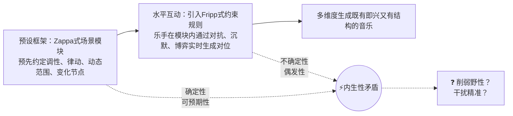

# King Crimson和Frank Zappa：探寻即兴与结构并存的创作范式

在二十世纪前卫音乐与实验摇滚的历史长河里，即兴和结构到底该怎么共存，一直是个躲不开的核心难题。也就是说，怎样做到既有爵士一般的自由、又有古典一般的严密。对于那些想把艺术推到极致的作曲家来说，传统的记谱法虽然能搭起严密的结构框架，却在即时表达上差点灵魂；反过来，纯粹放手让乐手自由即兴，能量是爆棚了，可却无法做到精密的结构设计。音乐的结构分为横向结构和纵向结构，前者如段落曲式安排，这和即兴的融合还相对比较常见，**真正困难的是后者，即多声部的对位，怎样让不同乐手即兴地在同一时间演奏出有音高结构的东西**。

这不是前卫摇滚凭空发明的问题。早在文艺复兴时期，教堂里的乐手们就在素歌旋律上即兴叠加复调线条，时人管这叫“意念中的对位”（contrapunto alla mente）——本质上，就是在严格的和声约束下，靠直觉和训练实时编织多个独立声部。五百年后，爵士钢琴家Bill Evans把低音提琴从伴奏角色里解放出来，让钢琴、贝斯、鼓在即兴中彼此对话、互为对位，创造出一种流动的复调织体。这些先例证明，即兴与对位并非天生冤家，只是在不同时代、不同语境下，平衡点极难拿捏。而King Crimson和Frank Zappa，正是在摇滚语境里为这道古老难题交出了新的答卷。

King Crimson和Frank Zappa这两个从不按套路出牌的家伙，各自搞出了一套让即兴和结构死死咬合在一起的范式：

- **Robert Fripp与King Crimson**搞的是**水平对话**的“集体谈判”——结构不是事先画好的图纸，而是在乐手彼此试探、摩擦、博弈的过程中，从混沌里一点一点“长”出来的。这是一种动态的、自组织的“**对位即兴**”。
- **Frank Zappa**走的是**垂直指挥**的路子——他是总建筑师，结构框架事先搭好，乐手在规定的时间槽和调性容器里自由发挥，但整体走向从未离开过作曲家手里那根看不见的指挥棒。这是一种受控的、高度结构化的“**容器式即兴**”。

这两条路，一横一纵，都通向了“即兴与结构并存”的结果。它们反映的共同精神是对音乐的“即时性”/“临场感”的崇尚：Zappa说过“音乐只有在被奏响的当下才有灵魂”，Fripp则管这叫“存在”（The Presence）。两人对录音和现场的关系也看法一致，都倾向于用现场录音直接作为专辑正式版本：King Crimson的“虚拟录音棚”用现场录音做专辑底子，Zappa的“异时同步”把不同时空的现场即兴缝合进录音室作品。录音棚不再是一个记录工具，而是把即时性的“当下”凝固、重组、再创造的车间。事实上，这种对“即时性”灵魂的执念，绝不只是前卫摇滚圈子里的专利，爵士乐里Miles Davis创作的《Bitches Brew》、John Zorn创作的《Cobra》、二十世纪严肃音乐里Stockhausen创作的《Aus den sieben Tagen》，都有着相同的执念。这些来自完全不同音乐世界的探索，指向的是同一种确信：音乐最珍贵的那口气，不是雕琢完谱面然后机械执行，是在某个特定瞬间“发生”出来的。

## 一、King Crimson：结构来自于在“集体谈判”中的对抗与协商

### 从早期摸索到成熟范式

King Crimson早期的即兴实验，比如1969年专辑《In the Court of the Crimson King》里的《Moonchild》，带着一股磕磕绊绊的摸索味儿。那段长达十分钟的即兴，结构松散，乐手之间像是各画各的点彩涂鸦，还没找到彼此的呼吸节奏。

真正让这套范式站住脚的，是1972年到1974年间的那个经典阵容：Robert Fripp、Bill Bruford、John Wetton、David Cross，加上早期的Jamie Muir。这个阶段的即兴不再是排练时的随手涂鸦，而变成了一场高度紧张、彼此实时博弈的集体游戏——用音乐学家Bohling的话说，叫“集体谈判”。

### 《Providence》：“集体谈判”的教科书案例

像1974年专辑《Red》里的《Providence》这样的案例即使在King Crimson的作品中也是独特的。这曲子压根没进过录音棚，直接从1974年6月30日普罗维登斯那场演出里截出来的。Bohling在论文中展现了《Providence》为什么是King Crimson的“集体谈判”范式的最成熟的范本。

曲子开场，小提琴手David Cross在E和F之间颤巍巍地来回打转，Fripp的吉他回授在低音区死死咬住F不放，Wetton的贝斯进来后又甩出一个跨越F到B三全音的四音动机——高音部、中音部、低音部分别抱着E、F、B三个调性中心互不相让。这就是典型的“协商”状态：所有人都在试探，谁也不急着交出主导权。这种多个独立的旋律线条在听觉上形成的紧张关系，正是**对位**（Counterpoint）的本质——不是古典式的严格规则，而是一种自发的、充满对抗性的“**即兴对位**”。

到了三分半钟，Bruford的鼓声越来越密，从镲片边缘的零星试探逐渐凝聚成一个扎实的中速摇滚节拍。Wetton的贝斯第一个锁定这个律动，一个在F和B之间来回摇摆的固定音型死死咬住鼓的脊梁骨，Fripp和Cross跟着就顺杆爬了上来。虽然F和B谁才是真正的调性中心还没定论，但至少节奏上的共识达成了——这就是“节奏对齐期”的临界点。

音乐学家Bohling用强度图谱把这首曲子的演进拆成了四个阶段：

| **演进阶段**   | **时间戳区间** | **核心音乐特征**                                        | **结构性功能**               |
| :------------- | :------------- | :------------------------------------------------------ | :--------------------------- |
| **自由探索期** | 0:00 - 3:25    | 小提琴主导，无固定节拍，E/F/B调性博弈，形成即兴对位     | 建立悬疑感，初步互动试探     |
| **节奏对齐期** | 3:25 - 5:15    | 鼓组密度增加，5:09建立摇滚律动，贝斯锁定F/B骨架         | 结构性凝聚，寻找共同律动目标 |
| **能量饱和期** | 5:15 - 8:20    | 全员进入重型Ostinato，强度峰值                          | 达成最终共识，结构爆发       |
| **瓦解与收尾** | 8:20 - 11:20   | Bruford以为结束先停手，Cross和Wetton继续，调性最终回归F | 结构的诗意消解               |

最妙的是结尾。当所有人都在B音上齐奏到最高潮，Bruford一镲定音以为完事儿了，Cross和Wetton却顶着镲片的余音继续低音量演奏，Cross还悄悄把调性拽回了F。这一手“回马枪”让前面的炸裂高潮变成了一个巨大的伪终止，音乐最终在F的静谧里慢慢消散。可惜当年《Red》专辑因为时长限制把这个两分钟的尾巴剪掉了，完整版直到后来才重见天日。

### “集体谈判”的进化轨迹

《Providence》不是一天练成的。在此之前，King Crimson的“集体谈判”走过一条清晰的进化路：

- **《We'll Let You Know》**（1973.10）：贝斯手Wetton绝对主导。开场大家磨蹭了一分半钟，Wetton用一个四音动机钉死F调和中速律动，其他人立刻跟上。结构逻辑是“一人提案，众人附议”，从头到尾没换过调性，三分半钟匆匆收场。
- **《Trio》**（1973）：Bruford全程没碰一下鼓，把结构主导权完全交给Wetton的低音和弦进行。鼓手选择不参与，本身就是一个高级的结构决策——他意识到那一刻的静谧已经够完美了，任何多余的节奏都会毁掉它。
- **《Starless and Bible Black》**（1973）：主导权转移到Bruford的鼓。每一次段落转换都由鼓的节奏变化发信号——3分49秒打出三拍子交叉节奏，4分40秒提速，Fripp和Cross立刻用和声分裂来回应。
- **《Is There Life Out There?》**（1974.6）：真正的多维度集体编织。Bruford和Wetton同时试图改速度，结果反而让整个乐队慢了下来；Fripp和Cross趁机用hocket技巧互相抛接音符，把织体从主调音乐撕裂成复调碎片；Wetton则在混乱中把调性从 $F$ 拽到了 $E\flat$。节奏、织体、调性三个维度同步变形又同步回归——这才是成熟的“集体谈判”。

### 虚拟录音棚：现场 $\approx$ 终版

《Providence》的成功证明了一件事：高自由度的集体即兴，只要掌握了一定方法，再加上后期的恰当剪辑，完全可以匹敌甚至碾压录音棚里一轨一轨磨出来的东西。《Providence》范式夯实了后续King Crimson实现“虚拟录音棚”理念所需要的基本功。在这个理念下，现场舞台就是实验室、录音棚，即时在录音棚录音，理想情况也是如现场一样一遍过，事实上就和现场没差。所以现场录音只要把观众声和环境杂音去掉，就是专辑成品。这样专辑正式版中也不失现场一锤子买卖的那种紧张感和呼吸感。

代表案例有两个。一是《Starless and Bible Black》这张专辑，大约三分之二的内容来自1973年阿姆斯特丹现场，Fripp在录音棚里补叠了《Fracture》这类复杂段落的吉他轨。二是2014-2021年“八人阵容”时期的《Radical Action to Unseat the Hold of Monkey Mind》，掌声和环境音被彻底抹掉，听着像钻进了一个没有物理边界的“虚拟录音棚”。

这套范式说到底是一个理念：即兴不是来拆结构的台，而是结构在时间流动中实时生长的一种方式。

## 二、Frank Zappa：在垂直指挥中“控”住即兴

如果说King Crimson是在水平对话里“长出”结构，那Frank Zappa就是用精密的结构框架来“容纳”即兴。Zappa对即时性的执念不输Fripp，他始终追求古典般严密和爵士般自由的共存。但他的操作逻辑完全相反——他是绝对的中心，结构在他脑子里预先成型，乐手是执行指令的精密插件。

### 《King Kong》和《The Grand Wazoo》：手势指挥和蓝图式即兴

Zappa在垂直指挥这条路上，演化出了两种互补的控制手段：一种是舞台上实时生效的“**手势指挥**”，另一种是写进总谱里的“**蓝图式即兴**”。两者核心逻辑一致——框架先行，即兴填空——但执行媒介和复杂程度不同。

**《King Kong》是“手势指挥”的典范**。这首曲子的主题基于E-flat Dorian调式，踩着复杂的3/8拍，本身就是一个严丝合缝的结构模块。但这副骨架只是起点——Zappa靠的是一套复杂到令人头皮发麻的手势信号系统，现场演出时拽头发、举手指、打暗号，随时把乐队的节奏切进雷鬼律动、改变调性、点名某个乐手杀进群体即兴。就在这种实时指令下，不同乐器组被强行塞进同一个时间槽，形成了一种**在指挥棒下即时生成的“对位”**——不是古典式的严格按照谱面，也不是King Crimson式的水平博弈，而是由一个人从外部进行实时编排的多声部互动。这套手势系统后来被先锋音乐家Butch Morris系统化为一套名为“**传导**”（Conduction）的指挥语汇，用标准化的手势在即兴现场实时构建复杂的编曲和结构，进一步印证了Zappa这种方法论背后的学理深度。

| **控制维度**     | **《King Kong》（手势指挥）** | **《The Grand Wazoo》（蓝图式即兴）** |
| :--------------- | :---------------------------- | :------------------------------------ |
| **结构载体**     | 主题旋律 + 手势信号系统       | 全编制、多声部的详尽总谱              |
| **对位生成方式** | 指挥棒下的实时调度            | 预设蓝图内的自由填充                  |
| **乐手角色**     | 被“指挥”进未知领域的执行者    | 在明确参数槽位内即兴的“模块化”协作者  |

如果说《King Kong》是Zappa在舞台上当“交通警察”，那么《**The Grand Wazoo**》则体现了更深层的控制——他把“交通规则”直接写进了总谱的蓝图里。

要理解这种“蓝图式即兴”，得先看看当时他手里的这支乐队。《The Grand Wazoo》是Zappa的大编制融合爵士的典型案例，1972年Grand Wazoo二十人大乐团的编制堪称奇观：常规的铜管与木管之外，Zappa还塞进了倍低音萨鲁管（Contrabass Sarrusophone）和高空长号（Trombone of the Upper Atmosphere）这种怪异兵器。倍低音萨鲁管由Earle Dumler操持，发出一种沙哑怒吼般的极低频，像一头蹲在铜管组脚下喘粗气的巨兽；Bruce Fowler的高空长号则在人耳能承受的极限高音区灵巧飞掠，把长号的笨重印象击得粉碎。能够支撑起这样的大编制作品，正依赖于即兴范式的进一步完善。这群声部各异的乐手，就是Zappa实现“容器式即兴”的模块化硬件。

这种“蓝图式即兴”的具体运作方式，可以从以下几个层面来理解：

- **主题作为对位蓝图**：
  - 《The Grand Wazoo》的核心构造是一个四小节的主题，被Zappa反复使用了四次，每次都在不同的配器环境中呈现——在乐谱上，这四次陈述被标记为Blocks A到D。
  - 在同一段旋律的每一次“重生”中，低音的走向、和声的密度、铜管与木管的对话方式都在变化。乐谱不是一份“照谱演奏”的死命令，而是一个精心设计的**对位容器**——容器的形状由Zappa预先划定，但容器内部的声音质感，由乐手在每次演奏中即兴填充。

- **独奏中的预制对位**：
  - 在主题陈述之后，Zappa为自己预留了一个12小节的吉他独奏块（在乐谱上标记为Block I），而伴奏部分并非简单的节奏循环，而是由铜管声部演奏的一个**上行的三和弦进行**。
  - 这段进行本身就是一个独立的、被严格写定的对位线条——吉他在上方自由即兴，铜管在下方以预制旋律与之呼应。蓝图与即兴，被编织进了同一张复调之网。

- **版本差异揭示的控制哲学**：
  - Sloots对比乐谱和录音后发现，乐谱上为键盘部分写下的复杂和弦序列，在录音中被大幅简化——但那些“被删除”的和声信息，转而由其他声部的**对位旋律线**来承担。
  - 一个铜管乐手的即兴填充，取代了键盘手被写死的和弦。乐谱提供的是**对位蓝图**，而非不可更改的绝对指令。结构既在纸上，也在纸外。

这种控制思维在Zappa的作品中有着清晰的技术脉络。早在1967年的《Absolutely Free》中，他就在《America Drinks》里使用手势信号来指示不同乐手在不同的拍号中演奏，创造出复合节奏的对位效果。到了1972年的作品《Little Dots》，总谱上甚至出现了只有时值和大致轮廓、没有确切音高的“小点”——这是一份“开放源代码”的蓝图，要求乐手在严格执行节奏框架的同时，凭直觉和对位意识去填充音高。此后的《Approximate》更是把音高几乎完全剥离，只剩精确到毫发的节奏对位框架，乐手必须在特定时刻喷射出任意音高的音符，靠纯粹的时间安排和休止与爆发的对比来构建结构——对位的概念被Zappa从音高维度拓展到了纯粹的节奏维度。

无论是手势指挥还是蓝图式即兴，它们共享同一个核心逻辑：**结构先行**。作曲家先有结构构想，再把乐手的即时创作力精准地嵌入框架的空格里。Zappa的即兴从来不是“想弹什么就弹什么”，而是在规定的时间、规定的调性、规定的声部角色里，“在规定区域内填空”。

### 异时同步：把不同时空的即兴缝进同一个结构

Zappa在“虚拟录音棚”的理念上显然是更加执着的，他的大部分专辑都是现场录音剪辑出来的。然而比起King Crimson更“邪门”一点，是Zappa发明了“异时同步”（Xenochrony）。这词在希腊语里的意思是“奇异的时间同步”，说白了就是把不同时间、不同地点录的即兴片段强行缝到一块儿，哪怕速度和拍号根本对不上。

《Rubber Shirt》是最极端的例子。Zappa把Vinnie Colaiuta在11/4拍下录的鼓轨，和Patrick O'Hearn在4/4拍、完全不同速度下录的贝斯轨，像拼DNA片段一样拼在一起。出来的结果是一种人类乐手在现场绝对搞不出来的超常节奏关系——两名乐手从未在同一时空演奏过这段音乐，但双方在各自时空中都处于高度投入的即时创作状态，Zappa用结构框架把这两个完全异质的“当下”强行缝合成了一个全新的有机体。

这种技术暴露出Zappa范式的核心逻辑：结构先行。作曲家先有结构构想，再从海量的即兴素材库里打捞合适的碎片，像剪辑电影一样把不同时空的表演拼成一个整体的叙事。乐手的即时性被尊重、被保留，但它最终服务的是一部作曲家大脑中已然成型的作品。

| **技术特征**       | **具体应用案例**           | **艺术目标**                   | **技术手段**                         |
| :----------------- | :------------------------- | :----------------------------- | :----------------------------------- |
| **Xenochrony**     | 《Friendly Little Finger》 | 创造人类无法直接协作的异常律动 | 将更衣室的吉他独奏与已有鼓轨随机同步 |
| **Hand Signals**   | 《King Kong》现场          | 将偶发性纳入有序轨道           | 手势指挥风格切换                     |
| **Project/Object** | 全系列专辑互文             | 所有作品视为永恒演化的整体     | 旧录音片段重组为新作架构             |

## 三、两条岔路：垂直指挥 vs 水平对话

把Fripp和Zappa放在一起比，差异是根本性的。

| **维度**     | **King Crimson（水平对话）**                                 | **Frank Zappa（垂直指挥）**                                  |
| :----------- | :----------------------------------------------------------- | :----------------------------------------------------------- |
| **骨架生成** | 弱预设/动态生成：骨架在现场互动中实时涌现                    | 强预设：骨架在演出前已由作曲家完全确立                       |
| **对位类型** | **博弈式对位**：多个独立声部通过实时互动，自发形成充满对抗性的复调结构 | **蓝图式对位**：在预先设定的声部框架内，通过乐谱或规则限定即兴的边界 |
| **即兴性质** | 构成性即兴：即时互动直接决定音乐方向                         | 装饰性即兴：在规定的时间槽内填空                             |
| **对待错误** | 创造性转化：偶然失误可能成为新动机的起点                     | 零容忍：误读信号即技术失误，追求机械精准                     |
| **技术媒介** | 约束规则、Frippertronics、沉默                               | 手势指令、详尽的乐谱、异时同步                               |

### 更罕见，也更脆弱

King Crimson这套“自下而上”的水平对话模式，在整个摇滚史乃至爵士史上都属于稀罕物件，也许也可以说它是更加“前卫”的。与他们在哲学上暗合的，是自由爵士先驱Ornette Coleman提出的“**和声旋律理论**”（Harmolodics）。Coleman主张旋律、和声、节奏完全平等，每个乐手都可以从自己的调性中心出发，通过直觉性的群体律动形成整体统一，而不是由一个外部框架来统领，从而也实现了多个独立声部在实时博弈中自发形成复调。区别在于，Coleman把这种完全民主的即兴对位变成了一套自觉的理论体系，而King Crimson更像是靠具体的约束规则和成员的默契在实践层面摸到了相似的路子。在Coleman之后比他更大胆的是John Coltrane的《Ascension》这部作品，这部作品中十一人庞大编制的集体即兴呈现了“声音丛林”这个声场概念，靠彼此监听和实时响应，构建整体能量流动上的结构。

实验性的另一面是它的脆弱性。Bill Bruford曾直言不讳地吐槽过这种模式的痛点：

> 按Bill Bruford的说法，Crimson创作音乐的过程 “像拔牙一样痛苦！对于Robert一气呵成写好的曲子，例如「Fracture」，乐队在排练的时候就非常顺利。如果Robert可以像这样拿出更多更完善的产出，那乐队作曲本可以更加顺畅。然而Robert却总是习惯于拿半成品给我们——每每曲子只写上半截就拿到排练室，他指定了大方向后让整个乐队一边演奏一边作曲……「Fracture」算是他唯一的例外。”

这意味着乐手不仅要负责演奏，还得在极不确定的环境下同时承担作曲者的职能。Bruford后来回忆1973年Jamie Muir离队后的漫长巡演时承认，那段时间心力憔悴的部分原因就是“被迫不断即兴”。Muir在的时候，两个人可以互相分担节奏的约束，一个人实验时另一个人还能稳住脉搏；Muir一走，Bruford得独自扛起节奏骨架，还要和Fripp、Wetton、Cross实时博弈，这种双重负载对人的消耗是巨大的。

这证明了这种范式依赖于特定的人、特定的默契、特定的精神状态，而这种模式对乐手的精神压力又极大，所以乐手普遍很难在这种创作模式下坚持下来。1972-1974年的KC之所以能驾驭它，是因为Fripp亲自挑选了愿意且能够配合他这套玩法的人；但是后来这套阵营走向了解散，这是有其必然性的。

### 隐性独裁与表面民主的撕裂

更值得琢磨的是，即便在水平对话的表象之下，权力关系也远没有看起来那么平等。相反，King Crimson乐队在实质上要比Zappa的乐队独裁得多，Fripp被戏称为“摇滚暴君”不是没来由的。他设计约束规则——比如1981年给Bruford下的一系列禁令：

| Fripp的禁令/规则                       | **艺术要求**                                                 |
| -------------------------------------- | ------------------------------------------------------------ |
| “如果你有一个好主意，不要弹出来”       | 强迫乐手放弃第一反应中的陈词滥调，去寻找更深层的、与当下环境更契合的表达。 |
| “不要与乐队其他成员进行习惯性短句呼应” | 拒绝廉价的爵士式“呼应与对答”，维持音乐的张力与独立性。       |
| “任何已有的解决方案都是错误的”         | 强调音乐的实验性，即 Absolutum, Obsoletum（一旦确立，即刻过时）。 |
| “最大的张力产生于完全停止”             | 引入沉默（Silence）作为结构性的组成部分，强调非演奏的价值。  |

所以尽管乐手可以“自由”决策，但最终的判断标准、最终的通过权，握在Fripp一个人手里。

1972年巡演期间有过一个经典场景。Boz Burrell、Mel Collins和Ian Wallace几个偏爱放克音乐的成员在台上擅自启动了一段12小节布鲁斯进行，Fripp直接拒绝参与，抱着吉他冷着脸坐在台边。这不是水平对话，这是用沉默进行否决。Fripp的“不弹”和他在《Trio》里允许Bruford“不弹”是完全两码事——前者是权力压制，后者是共识达成。这种“表面民主、隐性独裁”的撕裂感，恰恰是水平对话模式最内在的悖论：它要求所有人都发自内心地认同同一套审美标准，而一旦标准由某人单方面定义，水平的幻觉就会破灭。

### Zappa的路为什么能走得更远

自然而然地，与其在King Crimson那种喘不过气的创作氛围下搞形式民主，大部分乐手都宁愿在明确指挥下从事自由度稍低但方向清晰的创作。Zappa的垂直指挥模式在可操作性上要稳健得多：

- **清晰的职能分工**：Zappa不需要乐手在审美上和他达成灵魂共振，只需要他们具备顶尖的技术执行力和专注度。乐手的核心任务是“在规定区域内填空”，而非“共同决定区域边界”，心理负荷显著降低。

- **框架先行的安全感**：他把结构框架搭好，规定好每个时间槽的参数——调性、律动、动态范围——然后把自由裁量权下放到每个槽位内部。乐手在明确边界内可以尽情发挥，不会因方向不明而陷入散乱。

- **即插即用的可扩展性**：Zappa那套手势指挥系统本身就是一套标准化的“接口”——新乐手只需要学会读取指令，不需要花一年半载去和乐队培养“集体默契”。正因如此，他一生合作过上百名顶尖乐手，成员更迭频繁却始终能保持作品质量和风格辨识度。

- **素材的模块化与可重组性**：这也是Zappa能把异时同步玩到极致的原因：他把现场的即时性素材拆成可替换的零件，后期再按照结构蓝图重新组装。这种思路更接近电影导演的剪辑逻辑，而非爵士乐队的即兴对话。

当然，Zappa模式的代价是乐手的主体性被大幅压缩——在Zappa的乐队里，乐手很难在音乐的根本走向上施加影响。这也是为什么他捧出的Terry Bozzio、Steve Vai、George Duke等一票大师，离开“暴君”之后往往呈现出截然不同的创作面貌。他们的个人意志，只有在脱离这套垂直指挥系统之后才能真正舒展。

## 四、范式统一的可能性？

既然两条路各有优劣，那它们有没有相容乃至统一的可能？这个问题是开放的。一方面，它们能在形式上相容，即先借鉴Zappa思路预设框架，再让乐手在框架内水平互动；另一方面，它们又可能在精神上是相互矛盾的，强行把两者焊在一起，会不会既削弱了前者的野性，又干扰了后者的精准？

总而言之，King Crimson和Frank Zappa的故事，与其说是一枚硬币的两面，不如说是同一条河流的南北两岸。他们都朝同一个方向流——追求音乐在“此时此刻”的真实温度和不可替代性——但河床的走势、两岸的风景、渡河的方式全不一样。King Crimson的水平对话模式，更接近生命体自组织的进化方式：没有一张预先画好的蓝图，结构在无数微小的实时博弈中“涌现”出来。它罕见、脆弱、效率低下、对人的损耗极大，但当它成功的时候，迸出来的火花是任何精密预制都模仿不了的。Frank Zappa的垂直指挥模式，更接近建筑师的设计和控制：结构先行，即兴被精准地嵌进框架的空格里。它稳健、可扩展、对乐手的个人审美依赖度低，但在极致的控制面前，某些不可替代的“人的温度”有时会从缝隙里悄悄流失。

这两条路没有高下之分。它们只是用不同的方式回答同一个问题：在一个音符可以被无限修饰、完美可以被工业量产的时代，怎么才能留住音乐诞生那一刻的呼吸和心跳？Fripp和Zappa给出的答案不一样，但他们都做到了。后来的前卫金属、数学摇滚、实验电子音乐的创作者们，无论更靠近哪一边的河岸，都多多少少喝过这条河的水。